# 🛡️ Ecosystem Validation System

> **"Deve diventare il comando standard da eseguire prima di ogni git push, garantendo che nessun commit possa mai compromettere la stabilità o la qualità dell'ecosistema Navigator."**

The Navigator ecosystem uses a **comprehensive, orchestrated validation system** that acts as a pre-push quality gate, ensuring that every commit maintains the highest standards of stability, quality, and performance.

---

## 📋 Table of Contents

- [System Architecture](#system-architecture)
- [Quick Start](#quick-start)
- [Validation Steps](#validation-steps)
- [Usage](#usage)
  - [Local Development](#local-development)
  - [CI/CD](#cicd)
  - [Selective Execution](#selective-execution)
- [Git Hooks](#git-hooks)
- [Bundle Size Configuration](#bundle-size-configuration)
- [Adding New Validators](#adding-new-validators)
- [Troubleshooting](#troubleshooting)

---

## 🏗️ System Architecture

The validation system follows a **modular, orchestrated architecture** with clear separation of concerns:

```
scripts/
├── validate-ecosystem.sh           # Main orchestrator
└── validators/                      # Modular validators
    ├── check-dependencies.sh       # Step 1: Dependency audit
    ├── run-lint.sh                 # Step 2: ESLint
    ├── run-unit-tests.sh           # Step 3: Unit tests + coverage
    ├── build-all.sh                # Step 4: Build packages + apps
    ├── run-e2e-tests.sh            # Step 5: Playwright E2E
    └── check-bundle-size.sh        # Step 6: Bundle size limits
```

**Design Principles:**

- 🚀 **Fast-fail behavior**: Stops at the first validation error
- 🎨 **Color-coded output**: ANSI colors for better terminal UX
- 🔧 **Modular validators**: Each step is a standalone script
- ⚡ **Selective execution**: `--only` flag for targeted validation
- 🤖 **CI optimization**: `--ci` flag for streamlined CI/CD execution

---

## ⚡ Quick Start

```bash
# Run full validation (all 6 steps)
pnpm validate

# Run validation in CI mode
pnpm validate:ci

# Run specific validation step
pnpm validate --only=lint
pnpm validate --only=test
pnpm validate --only=build
```

---

## ✅ Validation Steps

The orchestrator executes **7 validation steps** in sequence:

### 1. 🔍 **Dependency Check** (`check-dependencies.sh`)
- **Non-blocking**: `pnpm outdated` (informational)
- **Blocking**: `pnpm audit --audit-level=high --prod` (fails on high/critical vulnerabilities)

### 2. 🧹 **Lint** (`run-lint.sh`)
- Runs ESLint across all packages and applications
- Command: `pnpm lint --filter="..."`
- Ensures code style consistency
- **Note**: Temporarily disabled due to ESLint/AJV compatibility issue

### 2.5. 🧠 **Code Quality & Complexity** (`check-code-quality.sh`) **NEW**
- **Cognitive Complexity Analysis**:
  - Max cognitive complexity: 15 per function
  - Max cyclomatic complexity: 10 per function
  - Uses `eslint-plugin-sonarjs` for advanced analysis
- **Code Smell Detection**:
  - Large files (>500 lines)
  - TODO/FIXME comments
  - Excessive console.log statements
- **Non-blocking**: Provides warnings, doesn't fail the build
- **Purpose**: Prevents introduction of complex, unmaintainable code

### 3. 🧪 **Unit Tests** (`run-unit-tests.sh`)
- Runs Vitest across all packages
- Command: `pnpm test --filter="..." --coverage`
- Generates coverage reports
- **Coverage reporting** to Codecov in CI

### 4. 🏗️ **Build** (`build-all.sh`)
- Builds SDK packages first: `pnpm build --filter="@navigator.menu/*"`
- Then builds applications: `pnpm build --filter="./apps/*"`
- Validates that all code compiles successfully
- **Build artifacts cached** in CI for reuse in E2E job

### 5. 🎭 **E2E Tests** (`run-e2e-tests.sh`) **AUTONOMOUS**
- **Self-contained test orchestrator** that creates a fresh app for each run:
  1. **Setup**: Creates temporary directory `e2e-temp-app`
  2. **App Creation**: Uses `@navigator.menu/create-navigator-app` with `react-ts-e2e` template
  3. **Dependency Install**: `pnpm install` links local workspace packages (`workspace:*`)
  4. **Verification**: Checks that `@navigator.menu/core` and `@navigator.menu/react` are linked
  5. **Server Start**: Launches Vite dev server in background (PID tracked)
  6. **Readiness Check**: Waits for `http://localhost:5173` (60s timeout)
  7. **Test Execution**: Runs Playwright tests from `tests/e2e/` using centralized config
  8. **Cleanup**: `trap cleanup EXIT` ensures server is killed and temp directory removed (always runs)
- **Why autonomous?**: Tests the actual user experience - from app creation to runtime behavior
- **Template**: `react-ts-e2e` includes Playwright pre-installed, test app with `useNavigator` hook
- **Centralized Tests**: `tests/e2e/navigator-core.spec.ts` (11 tests across 4 suites)
- **Runs in parallel** with other jobs in CI

### 6. 📏 **Bundle Size** (`check-bundle-size.sh`)
- Validates bundle sizes against configured limits
- Command: `pnpm size-limit`
- Reads configuration from `package.json`

---

## 🚀 Usage

### Local Development

```bash
# Before pushing your changes
pnpm validate
```

If any step fails, the script exits immediately with a clear error message.

**Shortcut**: The validation is automatically triggered by the **pre-push git hook** (see [Git Hooks](#git-hooks)).

### CI/CD

The GitHub Actions workflow (`.github/workflows/validation.yml`) uses an **intelligent parallel execution strategy**:

#### 🧠 Smart CI Architecture

Instead of running all steps sequentially (15+ minutes), the CI splits validation into **4 parallel jobs**:

```
┌─────────────────────────────────────────────────────────────┐
│  Job 1: Lint + Unit Tests + Quality     (~2 min)  ⚡       │
│  Job 2: Build + Bundle Size             (~3 min)  🏗️       │
│  Job 3: E2E Tests                       (~5 min)  🎭       │
│  Job 4: Validation Summary              (~10 sec) 📊       │
└─────────────────────────────────────────────────────────────┘
         ↓              ↓              ↓
    Total CI time = slowest job (5 min) instead of sum (15+ min)
    = 66% time reduction! 🚀
```

#### 🔧 Job Details

**Job 1: `lint_and_unit_test`** (fast)
- Dependency check
- Code linting (when enabled)
- **Code quality & complexity analysis** 🧠 (NEW)
- Unit tests with coverage
- **Codecov integration** (reports coverage to PRs)

**Job 2: `build_and_size_check`** (medium)
- Build all packages
- Bundle size validation
- **Uploads build artifacts** (cached for E2E job)

**Job 3: `e2e_test`** (slow, bottleneck)
- **Downloads build artifacts** (no rebuild needed)
- Installs Playwright browsers
- Runs E2E tests
- Uploads Playwright report on failure

**Job 4: `validation_summary`** (always runs)
- Checks results of all previous jobs
- **Posts comment to PR** with validation results table
- Shows ✅/❌ status for each check
- Provides link to VALIDATION.md

#### 📦 Artifact Caching

Jobs share build artifacts to avoid duplicate work:

```yaml
# Job 2 uploads
- name: Upload build artifacts
  uses: actions/upload-artifact@v4
  with:
    name: packages-build
    path: packages/*/dist

# Job 3 downloads
- name: Download build artifacts
  uses: actions/download-artifact@v4
  with:
    name: packages-build
```

**Benefit**: E2E tests run against the exact same build as size checks.

#### 🤖 PR Guardian Bot

Every PR gets an automated comment with validation status:

```markdown
## 🤖 Ecosystem Validation Report

| Check | Status |
|-------|--------|
| **Lint & Unit Tests** | ✅ success |
| **Build & Bundle Size** | ✅ success |
| **E2E Tests** | ❌ failure |

⚠️ **Some checks failed.** Please review the details above.
```

**Features**:
- Real-time feedback without checking Actions tab
- Visual table for quick status overview
- Link to validation documentation
- Runs even if jobs fail (uses `if: always()`)

**Old CI Behavior** (sequential):
```
Dependencies → Lint → Test → Build → E2E → Size = 15+ minutes
```

**New CI Behavior** (parallel):
```
Job1 (Lint+Test) ────┐
Job2 (Build+Size) ───┼──→ Summary → PR Comment
Job3 (E2E) ──────────┘
Total time = 5 minutes (66% faster!)
```

### Selective Execution

Use the `--only` flag to run a specific validation step:

```bash
# Run only dependency check
pnpm validate --only=dependencies

# Run only linting
pnpm validate --only=lint

# Run only unit tests
pnpm validate --only=test

# Run only build
pnpm validate --only=build

# Run only E2E tests
pnpm validate --only=e2e

# Run only bundle size check
pnpm validate --only=size
```

**Use cases**:
- 🐛 **Debugging**: Focus on a specific failing step
- ⚡ **Speed**: Skip unrelated checks during rapid iteration
- 🎯 **Targeted fixes**: Validate only what you changed

### Help

```bash
pnpm validate --help
```

---

## 🪝 Git Hooks

The validation system is integrated via **Husky pre-push hook**:

**`.husky/pre-push`**:
```bash
#!/bin/sh
. "$(dirname "$0")/_/husky.sh"

# Run full ecosystem validation before push
pnpm validate
```

**Behavior**:
- ✅ If validation passes → push proceeds
- ❌ If validation fails → push is **blocked**
- 🛑 No broken code can reach the remote repository

**Manual override** (use with caution):
```bash
git push --no-verify
```

---

## 📏 Bundle Size Configuration

Bundle size limits are defined in `package.json`:

```json
{
  "size-limit": [
    {
      "path": "packages/core/dist/index.js",
      "limit": "15 KB"
    },
    {
      "path": "packages/react/dist/index.js",
      "limit": "1 KB"
    },
    {
      "path": "packages/plugin-keyboard/dist/index.js",
      "limit": "2 KB"
    }
  ]
}
```

**Dependencies**:
```bash
pnpm add -D size-limit @size-limit/preset-small-lib
```

**How it works**:
- `check-bundle-size.sh` runs `pnpm size-limit`
- If any bundle exceeds its limit → validation fails
- Prevents bundle size regression

**Adding new limits**:
1. Add entry to `size-limit` array in `package.json`
2. Specify `path` (relative to workspace root)
3. Specify `limit` (e.g., `"15 KB"`, `"500 B"`)

---

## 🔧 Adding New Validators

To add a new validation step:

### 1. Create Validator Script

**`scripts/validators/my-new-check.sh`**:
```bash
#!/bin/bash
#
# My New Check
# Description of what this validator does
#

set -e

echo "🔍 Running my new check..."
echo ""

# Your validation logic here
# Exit with non-zero code on failure

echo ""
echo "✅ My new check completed"
```

### 2. Make It Executable

```bash
chmod +x scripts/validators/my-new-check.sh
```

### 3. Add to Orchestrator

Edit `scripts/validate-ecosystem.sh`:

```bash
# Add to the STEPS array
STEPS=(
  "dependencies:check-dependencies.sh:Dependency Check"
  "lint:run-lint.sh:Linting"
  "test:run-unit-tests.sh:Unit Tests"
  "build:build-all.sh:Build"
  "e2e:run-e2e-tests.sh:E2E Tests"
  "size:check-bundle-size.sh:Bundle Size"
  "mynew:my-new-check.sh:My New Check"  # Add here
)
```

### 4. Update Help Text

Add your new step to the `--help` output in `validate-ecosystem.sh`:

```bash
echo "  --only=mynew        Run only My New Check"
```

### 5. Test

```bash
# Test the new step in isolation
pnpm validate --only=mynew

# Test full validation
pnpm validate
```

---

## 🛠️ Troubleshooting

### ❌ Validation fails with "command not found"

**Problem**: A required dependency is missing.

**Solution**: Ensure all dependencies are installed:
```bash
pnpm install
pnpm playwright install --with-deps chromium
```

---

### ❌ E2E tests fail with "server not ready"

**Problem**: Development server didn't start in time.

**Solution**: 
- Check if port `5173` is already in use
- Increase timeout in `run-e2e-tests.sh`:
  ```bash
  wait-on http://localhost:5173 --timeout 120000  # 2 minutes
  ```

---

### ❌ Bundle size check fails after adding new feature

**Problem**: New code increased bundle size beyond limit.

**Solution**:
1. **Analyze bundle**:
   ```bash
   cd packages/core
   pnpm build --analyze
   ```
2. **Options**:
   - Optimize code to reduce size
   - Use dynamic imports for large dependencies
   - Update limit in `package.json` (if justified)

---

### ❌ Lint fails on autogenerated files

**Problem**: ESLint tries to lint files that shouldn't be checked.

**Solution**: Add to `.eslintignore`:
```
dist/
coverage/
*.config.js
```

---

## 🛡️ Branch Protection Rules

To enforce validation in your repository, configure **branch protection rules** for `main`:

### Quick Setup

1. Navigate to: `Settings → Branches → Add rule`
2. Branch name pattern: `main`
3. Enable these settings:

**✅ Required Status Checks**
- [x] Require status checks to pass before merging
- [x] Require branches to be up to date before merging

Select these CI jobs:
- `lint_and_unit_test`
- `build_and_size_check`
- `e2e_test`

**✅ Additional Protection**
- [x] Require pull request before merging
- [x] Require conversation resolution before merging
- [x] Require linear history
- [x] Include administrators

**Result**: 
- ❌ Direct pushes to `main` are **blocked**
- ❌ PRs with failing checks cannot be merged
- ✅ Only validated code reaches `main`

**Detailed Guide**: See [BRANCH_PROTECTION_GUIDE.md](./docs/BRANCH_PROTECTION_GUIDE.md)

---

## 📊 Metrics & Monitoring

### Code Coverage

Coverage reports are automatically generated and uploaded to **Codecov**:

- **Unit tests**: Coverage tracked per package
- **PR comments**: Codecov bot posts coverage diff
- **Trends**: Track coverage over time
- **Threshold**: Set minimum coverage requirements

Configure in `package.json`:
```json
{
  "scripts": {
    "test:coverage": "vitest run --coverage"
  }
}
```

### Code Quality Metrics

The `check-code-quality.sh` validator tracks:

- **Cognitive complexity**: Max 15 per function
- **Cyclomatic complexity**: Max 10 per function  
- **Large files**: Warn on files >500 lines
- **Code smells**: TODO comments, console.log usage

**View results**: Check validator output in CI logs

### CI Performance

Monitor CI efficiency:

- **Parallel execution**: 3 jobs run simultaneously
- **Artifact caching**: Build once, reuse in E2E
- **Total runtime**: ~5 minutes (66% faster than sequential)

**GitHub Actions Usage**: Check `Settings → Actions → Usage`

---

## 🎯 Best Practices

1. **Run validation before pushing**:
   ```bash
   pnpm validate  # Catches issues locally
   git push       # Triggers pre-push hook
   ```

2. **Use selective validation during development**:
   ```bash
   pnpm validate --only=test  # Fast iteration
   ```

3. **Never skip validation** (unless emergency hotfix):
   ```bash
   git push --no-verify  # ⚠️ Use with extreme caution
   ```

4. **Review CI feedback on PRs**:
   - Check validation summary comment
   - Review failed job logs
   - Fix issues before requesting review

5. **Monitor code quality warnings**:
   - Address complexity warnings proactively
   - Refactor functions with high cognitive complexity
   - Keep files under 500 lines when possible

6. **Keep coverage high**:
   - Write tests for new features
   - Aim for >80% coverage
   - Review Codecov reports on PRs

---

## 📚 Related Documentation

- [Contributing Guide](./CONTRIBUTING.md)
- [Branch Protection Guide](./docs/BRANCH_PROTECTION_GUIDE.md)
- [Cookbook Refactoring Summary](./docs/COOKBOOK_REFACTORING_SUMMARY.md)
- [GitHub Actions Workflow](./.github/workflows/validation.yml)

---

### ⚠️ Pre-push hook doesn't run

**Problem**: Husky not initialized.

**Solution**:
```bash
pnpm prepare  # Runs husky install
```

---

### 🐛 Need to debug a specific validator

**Run validator directly**:
```bash
bash scripts/validators/run-lint.sh
```

**Add debug output**:
```bash
set -x  # Enable debug mode (prints each command)
```

---

## 📊 Validation Workflow

```mermaid
graph TD
    A[pnpm validate] --> B{Parse Arguments}
    B --> C[Step 1: Dependencies]
    C -->|Pass| D[Step 2: Lint]
    C -->|Fail| Z[❌ Exit 1]
    D -->|Pass| E[Step 3: Unit Tests]
    D -->|Fail| Z
    E -->|Pass| F[Step 4: Build]
    E -->|Fail| Z
    F -->|Pass| G[Step 5: E2E Tests]
    F -->|Fail| Z
    G -->|Pass| H[Step 6: Bundle Size]
    G -->|Fail| Z
    H -->|Pass| I[✅ Exit 0]
    H -->|Fail| Z
```



---

## 🎯 Best Practices

### 1. **Run Validation Frequently**
```bash
# Before committing
pnpm validate

# After pulling changes
pnpm validate
```

### 2. **Use Selective Execution During Development**
```bash
# Working on React package? Run only relevant checks
pnpm validate --only=lint
pnpm validate --only=test
pnpm validate --only=build
```

### 3. **Monitor Bundle Sizes**
```bash
# Check current bundle sizes
pnpm size-limit
```

### 4. **Keep Dependencies Updated**
```bash
# Check for outdated packages
pnpm outdated

# Audit for vulnerabilities
pnpm audit
```

### 5. **Review CI Failures**
- Check GitHub Actions logs
- Download artifacts (Playwright reports, coverage)
- Reproduce locally: `pnpm validate:ci`

---

## 🚀 Next Steps

- ✅ Run validation before every push
- 📊 Monitor bundle sizes in PRs
- 🔒 Keep dependencies secure with regular audits
- 📈 Increase test coverage over time
- 🎯 Add custom validators for project-specific needs

---

**"Nessun commit può mai compromettere la stabilità o la qualità dell'ecosistema Navigator."** ✨

