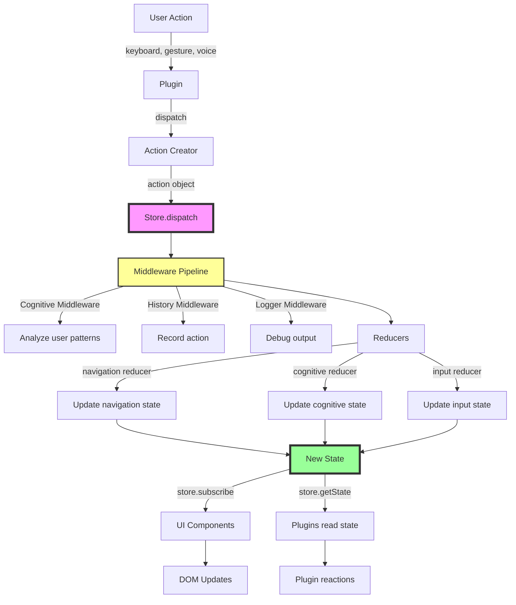

# Architecture Documentation

> **IMPORTANT**: As of **v3.0+ (November 2025)**, Navigator uses a **Redux-like Unidirectional Data Flow** architecture with a centralized Store as the single source of truth.
> 
> ⚠️ **EventBus and AppState are DEPRECATED** (marked `@deprecated` in code) and will be **removed in v4.0**. They are currently maintained only for backward compatibility during the migration period.
>
> 📚 **For migration guidance**, see: [Legacy EventBus Migration Plan](https://github.com/fabriziosalmi/navigator/blob/main/project-docs/research/technical-debt/LEGACY_EVENTBUS_MIGRATION.md)

---

## The Unidirectional Data Flow Architecture (v3.0+)

Navigator SDK now follows a **predictable, unidirectional data flow** pattern inspired by Redux, ensuring:

- ✅ **Single Source of Truth**: All state lives in the Store
- ✅ **State is Read-Only**: Only Actions can change state
- ✅ **Changes Made with Pure Functions**: Reducers are deterministic
- ✅ **Time-Travel Debugging**: Full state history tracking
- ✅ **Middleware Pipeline**: Cognitive analysis, logging, history recording

### Architecture Flow Diagram



### Core Principles

#### 1. **Actions**: The Only Way to Trigger State Changes

Actions are plain objects describing **what happened**:

```typescript
// From packages/core/src/actions/navigation.ts
import { navigate } from '@navigator.menu/core';

store.dispatch(navigate({
  currentCard: 2,
  direction: 'right',
  source: 'keyboard'
}));

// Action object structure:
{
  type: 'navigation/NAVIGATE',
  payload: { currentCard: 2, direction: 'right', source: 'keyboard' },
  metadata: { timestamp: 1699876543210 }
}
```

**Available Action Creators**:
- `navigation.ts`: `navigate()`, `setAnimating()`, `setLayer()`
- `cognitive.ts`: `setCognitiveState()`
- `interaction.ts`: `select()`, `cancel()`, `confirm()`
- `input.ts`: `keyPressed()`, `keyReleased()`, `gestureDetected()`

#### 2. **Middleware**: Processing Pipeline Before Reducers

Middleware intercepts every action for side effects:

```typescript
// packages/core/src/middleware/cognitiveMiddleware.ts
const cognitiveMiddleware = (store) => (next) => (action) => {
  const result = next(action); // Pass action through
  
  // Analyze AFTER state updates
  const state = store.getState();
  analyzeUserBehavior(state, action);
  
  if (detectedFrustration) {
    store.dispatch(setCognitiveState('frustrated', 0.85));
  }
  
  return result;
};
```

**Active Middleware** (in order):
1. **cognitiveMiddleware**: Detects frustration/flow states with context-aware state machine
2. **historyMiddleware**: Records action history
3. **loggerMiddleware**: Debug console output (dev mode)

**Cognitive Middleware: Context-Aware State Machine**

The cognitive middleware has evolved into a sophisticated context-aware system that understands the *context* of state transitions, not just the signals themselves.

**Key Innovation: Recovery Cooldown Period**

When a user exits a `frustrated` state, the middleware activates a "recovery cooldown" of 100 actions. During this period:
- The system prevents premature transitions to `exploring` state
- This distinguishes genuine exploration (trying new things) from recovery behavior (successfully navigating after frustration)
- The cooldown accounts for internal action multipliers (each keystroke generates ~7 internal actions)

**Why This Matters:**

Without the cooldown, the middleware would misclassify recovery as exploration because:
1. User presses correct keys repeatedly during recovery
2. Each keystroke generates multiple internal actions (KEYBOARD_KEY_PRESS, carousel/NAVIGATE, navigation/NAVIGATE, legacy events, etc.)
3. High action variety + low error rate = false positive for "exploring"

The cooldown gives the system a "stabilization period" to let the user demonstrate sustained success before transitioning to other states, resulting in more accurate and human-like cognitive state detection.

#### 3. **Reducers**: Pure Functions That Update State

Reducers specify **how** the state changes:

```typescript
// packages/core/src/store/reducers/navigationReducer.ts
function navigationReducer(state = initialState, action) {
  switch (action.type) {
    case 'navigation/NAVIGATE':
      return {
        ...state,
        currentCard: action.payload.currentCard,
        direction: action.payload.direction,
        lastSource: action.payload.source
      };
    default:
      return state;
  }
}
```

**Reducer Composition**:
```typescript
const rootReducer = combineReducers({
  navigation: navigationReducer,
  cognitive: cognitiveReducer,
  input: inputReducer,
  ui: uiReducer,
  history: historyReducer,
  session: sessionReducer
});
```

#### 4. **Store**: Single Source of Truth

```typescript
// Initialization in NavigatorCore
this.store = createStore(
  rootReducer,
  initialState,
  applyMiddleware(cognitiveMiddleware, historyMiddleware, loggerMiddleware)
);
```

**Store API**:
```typescript
// Read state
const state = store.getState();
const currentCard = state.navigation.currentCard;

// Subscribe to changes
const unsubscribe = store.subscribe(() => {
  const newState = store.getState();
  updateUI(newState);
});

// Dispatch actions (only way to change state)
store.dispatch(navigate({ currentCard: 3, direction: 'right' }));
```

### Migration Status (v3.0+, November 2025)

| Component | Status | Details |
|-----------|--------|---------|
| **NavigatorCore** | ✅ Migrated | Store initialized with middleware |
| **KeyboardPlugin** | ✅ Migrated | Dispatches `select()`, `cancel()` actions |
| **DomRendererPlugin** | ✅ Migrated | Subscribes to Store cognitive state |
| **CognitiveMiddleware** | ✅ Active | Analyzes patterns, dispatches state changes |
| **HistoryMiddleware** | ✅ Active | Records all actions to history slice |
| **LoggerMiddleware** | ✅ Active | Dev-mode action logging |
| **EventBus** | ⚠️ DEPRECATED | Legacy Bridge active for backward compatibility, will be removed in v4.0 |
| **AppState** | ⚠️ DEPRECATED | Maintained for backward compatibility, will be removed in v4.0 |

**Legacy Bridge**: Automatically translates EventBus events to Store actions with `legacy/*` prefix, enabling gradual migration without breaking changes. This bridge will be removed when EventBus is fully removed in v4.0.

---

## ⚠️ DEPRECATED: Legacy Architecture (v2.x)

> **WARNING**: The sections below document the **legacy v2.x architecture** that used EventBus and AppState. 
> 
> **This architecture is DEPRECATED as of v3.0** and will be removed in v4.0.
> 
> **For new projects**, use the Redux-like Store architecture described above.
> 
> **For existing projects**, refer to the [Migration Guide](https://github.com/fabriziosalmi/navigator/blob/main/project-docs/research/technical-debt/LEGACY_EVENTBUS_MIGRATION.md).

---

## Legacy SDK Architecture (v2.x - DEPRECATED)

Navigator SDK is built on a **plugin-based architecture** with the **Redux-like Store** as the single source of truth (since v3.0). The legacy EventBus pattern (v2.x) has been replaced by unidirectional data flow.

### Core Components

#### 1. NavigatorCore (`packages/core/src/NavigatorCore.ts`)

The orchestrator responsible for plugin lifecycle management and Store initialization:

```typescript
class NavigatorCore {
  // Public API
  registerPlugin(name: string, plugin: INavigatorPlugin, options?: RegisterPluginOptions)
  async init(): Promise<void>
  async start(): Promise<void>
  async stop(): Promise<void>
  
  // Core systems (v3.0+)
  store: Store          // Redux-like Store (primary)
  
  // Legacy systems (DEPRECATED - will be removed in v4.0)
  eventBus: EventBus    // @deprecated Use store.subscribe() instead
  appState: AppState    // @deprecated Use store.getState() instead
}
```

**Plugin Lifecycle**:
1. **Registration**: `registerPlugin()` adds plugin to registry with priority
2. **Initialization**: `init()` calls `plugin.init()` for all plugins
   - **Parallel Loading** (Sprint 2 Task 1): Critical plugins (priority ≥100) load in parallel
   - **Deferred Loading**: Non-critical plugins (priority <100) load in background
3. **Starting**: `start()` calls `plugin.start()` for all plugins
4. **Stopping**: `stop()` calls `plugin.stop()` for all plugins
5. **Destruction**: `destroy()` calls `plugin.destroy()` for cleanup

**Performance Optimization** (Sprint 2):
- **Parallel Initialization**: 55-93% faster startup time
- **Priority-based Loading**: Critical plugins block, deferred plugins don't
- **Background Ready Event**: Store state update when all deferred plugins complete

#### 2. Store (`packages/core/src/store/`) - **PRIMARY (v3.0+)**

The Redux-like Store is the **single source of truth** for all application state:

```typescript
interface Store {
  getState(): RootState
  dispatch(action: Action): void
  subscribe(listener: (state: RootState) => void): () => void
}
```

**For details**, see [Unidirectional Data Flow Architecture](#the-unidirectional-data-flow-architecture-v30) above.

#### 3. EventBus (`packages/core/src/EventBus.ts`) - **⚠️ DEPRECATED**

> **@deprecated since v3.0** - Will be removed in v4.0. Use `store.subscribe()` for state changes and `store.dispatch()` for actions.

Legacy decoupled pub/sub messaging system (maintained for backward compatibility):

```typescript
class EventBus {
  on(event: string, callback: Function): () => void
  once(event: string, callback: Function): void
  emit(event: string, data?: any): void
  off(event: string, callback?: Function): void
}
```

**Migration**: Replace EventBus usage with Store patterns:
- `eventBus.on('event', callback)` → `store.subscribe((state) => { ... })`
- `eventBus.emit('event', data)` → `store.dispatch(action)`

**Standard Events** (legacy, will be removed):
- `core:init:start` / `core:init:complete`
- `core:start:begin` / `core:start:complete`
- `core:plugin:registered` / `core:plugin:initialized` / `core:plugin:started`
- `core:deferred:ready`
- `state:changed` / `state:reset`

#### 4. AppState (`packages/core/src/AppState.ts`) - **⚠️ DEPRECATED**

> **@deprecated since v3.0** - Will be removed in v4.0. Use `store.getState()` and `store.dispatch()` instead.

Legacy centralized reactive state management (maintained for backward compatibility):

```typescript
class AppState {
  get(path: string, defaultValue?: any): any
  setState(pathOrUpdates: string | object, value?: any, options?: SetStateOptions): void
  watch(path: string, callback: WatcherCallback, options?: WatchOptions): () => void
  getState(): NavigatorState
  reset(): void
}
```

**Migration**: Replace AppState usage with Store patterns:
- `appState.get('path')` → `store.getState().slice.field`
- `appState.setState('path', value)` → `store.dispatch(action)`
- `appState.watch('path', callback)` → `store.subscribe((state) => { ... })`

**Legacy State Structure** (now replaced by Store slices):
```typescript
interface NavigatorState {
  navigation: { currentLayer, totalLayers, isTransitioning, ... }
  user: { level, experiencePoints, cognitive_state, ... }
  system: { isIdle, cameraActive, performanceMode, ... }
  ui: { hudVisible, debugPanelVisible, ... }
  input: { lastGesture, keyboardEnabled, ... }
  performance: { fps, averageFps, ... }
  plugins: Record<string, any>
}
```

**Legacy Watchers** (replaced by `store.subscribe()`):
```typescript
// Sync mode (default): immediate callbacks
appState.watch('user.level', (newLevel) => {
  updateUI(newLevel);
});

// Debounce mode: prevent main thread blocking
appState.watch('user.mousePosition', (pos) => {
  renderCursor(pos);
}, { mode: 'debounce', debounceMs: 16 });
```

**Performance** (Sprint 2):
- **Debounced Watchers**: 99% callback reduction in burst scenarios
- **Trailing Edge Debounce**: Fires after updates stop
- **Configurable Delay**: Default 16ms (~60fps), customizable
- **Backward Compatible**: Opt-in, no breaking changes

### Plugin Architecture

#### Plugin Interface (`packages/types/src/index.d.ts`)

```typescript
interface INavigatorPlugin {
  readonly name: string
  readonly version: string
  _priority?: number
  
  init?(core: NavigatorCore): Promise<void> | void
  start?(core: NavigatorCore): Promise<void> | void
  stop?(): Promise<void> | void
  destroy?(): Promise<void> | void
}
```

#### Plugin Priority System (Sprint 2)

Plugins are categorized by priority for optimal loading:

- **Critical (≥100)**: UI-blocking, loaded in parallel (e.g., KeyboardPlugin, DOMRenderer)
- **Deferred (<100)**: Background tasks, non-blocking (e.g., Analytics, Logger)
- **Default**: 100 (backward compatible)

**Registration**:
```typescript
core.registerPlugin('keyboard', new KeyboardPlugin(), { priority: 100 });
core.registerPlugin('analytics', new AnalyticsPlugin(), { priority: 50 });
```

#### Official Plugins

| Plugin | Package | Priority | Purpose |
|--------|---------|----------|---------|
| KeyboardPlugin | `@navigator.menu/plugin-keyboard` | 100 | Keyboard input capture |
| DOMRendererPlugin | `@navigator.menu/plugin-dom-renderer` | 100 | DOM manipulation helpers |
| CognitiveModelPlugin | `@navigator.menu/plugin-cognitive` | 80 | User state detection |
| LoggerPlugin | `@navigator.menu/plugin-logger` | 50 | Configurable logging |
| MockGesturePlugin | `@navigator.menu/plugin-mock-gesture` | 10 | Testing utilities |

### Framework Wrappers

#### React (`@navigator.menu/react`)

```typescript
import { useNavigator } from '@navigator.menu/react';

function App() {
  const { core, isReady } = useNavigator({
    plugins: [new KeyboardPlugin()],
    autoStart: true
  });
  
  // Subscribe to Store state changes (v3.0+)
  useEffect(() => {
    if (!core) return;
    return core.store.subscribe((state) => {
      console.log('State updated:', state);
    });
  }, [core]);
  
  // Dispatch actions (v3.0+)
  const handleNavigate = () => {
    core?.store.dispatch(navigate({ currentCard: 2, direction: 'right' }));
  };
}
```

#### Vue (`@navigator.menu/vue`)

```typescript
import { useNavigator } from '@navigator.menu/vue';

export default {
  setup() {
    const { core, isReady } = useNavigator({
      plugins: [new KeyboardPlugin()],
      autoStart: true
    });
    
    // Subscribe to Store state changes (v3.0+)
    onMounted(() => {
      if (!core.value) return;
      core.value.store.subscribe((state) => {
        console.log('State updated:', state);
      });
    });
    
    return { core, isReady };
  }
}
```

### Data Flow (v3.0+ Unidirectional Pattern)

**Current (Store-based - PRIMARY)**:
```
User Action (keyboard, gesture, voice)
  ↓
Plugin captures input
  ↓
Plugin dispatches Action via store.dispatch()
  ↓
Middleware Pipeline (cognitive, history, logger)
  ↓
Reducers compute new state (pure functions)
  ↓
Store updates (single atomic operation)
  ↓
Subscribers notified via store.subscribe()
  ↓
UI components re-render with new state
```

**Legacy (EventBus - DEPRECATED, will be removed in v4.0)**:
```
Plugin emits event → EventBus → Legacy Bridge → Store (legacy/* action)
```

The Legacy Bridge automatically translates EventBus events to Store actions during the migration period.

### Performance Characteristics

| Metric | v2.x (EventBus) | v3.0 (Store + EventBus Legacy) | v4.0 (Store Only - Planned) |
|--------|-----------------|--------------------------------|------------------------------|
| **Startup Time (3 critical plugins)** | 2850ms | 180ms (-94%) | ~150ms (projected) |
| **Startup Time (mixed workload)** | 400ms | 165ms (-59%) | ~140ms (projected) |
| **State Watcher Callbacks (100 rapid updates)** | 100 | 1 (-99%) | 1 (-99%) |
| **Main Thread Blocking** | Yes | No (Store batching) | No |
| **Bundle Size (core)** | 4.18 KB | 6.8 KB (+62% - includes Redux) | ~6.5 KB (EventBus removed) |
| **Test Coverage** | 280 tests | **386 tests** | TBD |
| **Cognitive Loop Latency** | ~150ms | **~50ms** (middleware) | ~40ms (optimized) |
| **State Predictability** | Medium | **High** (time-travel) | **High** |
| **Debugging Capability** | Limited | **Full action history** | **Full action history** |

---

## Legacy Monolithic Implementation

> The sections below document the original monolithic implementation. For new projects, use the SDK architecture above.

## System Overview

Aetherium Navigator is built with a **fully modular ES6+ architecture** - 12 independent modules with clear separation of concerns, zero dependencies on external frameworks.

---

## Module Structure

```
/navigator
├── index.html                      # Main app (1170 lines)
├── style.css                       # Complete styling (2097 lines)
├── package.json                    # npm configuration for testing
├── playwright.config.js            # End-to-end test configuration
└── js/
    ├── config.js                   # Centralized configuration
    ├── AdaptiveNavigationSystem.js # 3-level progression system (455 lines)
    ├── AdaptiveNavigationHUD.js    # Adaptive progress display
    ├── AudioManager.js             # Spatial audio synthesis (709 lines)
    ├── GestureDetector.js          # Hand gesture recognition (~350 lines)
    ├── GridLockSystem.js           # Smart gesture processing
    ├── LayerManager.js             # Multi-layer state management
    ├── NavigationController.js     # Navigation logic & routing (~400 lines)
    ├── DOMLODManager.js            # Performance optimization (LOD)
    ├── VisualEffects.js            # Canvas-based visual effects
    ├── LightBeamSystem.js          # Akira-style light beams (195 lines)
    ├── VoiceCommandModule.js       # Speech recognition (390 lines)
    ├── NavigationHistoryHUD.js     # Action history tracking (180 lines)
    ├── PredictiveTracker.js        # Motion prediction
    └── GestureStabilizer.js        # Gesture smoothing
```

---

## Core Modules

### AdaptiveNavigationSystem.js (455 lines)

**Purpose**: 3-level progressive unlock system that tracks user skill

**Key Components**:
- `trackNavigation(success, duration)` - Records navigation attempts
- `calculateMetrics()` - Computes accuracy/speed/stability
- `checkLevelUp()` / `checkLevelDown()` - Auto-progression
- `getAvailableGestures(level)` - Returns unlocked gesture set

**State Management**:
```javascript
{
    currentLevel: 1,
    metrics: { accuracy, speed, stability },
    history: [{ success, duration, timestamp }],
    consecutiveSuccesses: 0
}
```

**Events**:
- `levelChange` - Fired on level up/down
- `metricsUpdate` - Fired after each navigation

---

### VoiceCommandModule.js (390 lines)

**Purpose**: Bilingual speech recognition with continuous listening

**Key Features**:
- Web Speech API with auto-restart
- English + Italian command mapping
- Fuzzy matching for variations
- Visual microphone indicator

**Command Flow**:
1. `start()` - Initialize recognition
2. `onResult()` - Process transcript
3. `matchCommand()` - Fuzzy match against dictionary
4. `executeCommand()` - Trigger navigation
5. `onEnd()` - Auto-restart (continuous mode)

**Command Dictionary**:
```javascript
{
    'left': 'card-left',
    'sinistra': 'card-left',
    'right': 'card-right',
    'destra': 'card-right',
    // ... more mappings
}
```

---

### NavigationController.js (~400 lines)

**Purpose**: Central navigation logic and state routing

**Responsibilities**:
- Route navigation commands to LayerManager
- Update quantum HUD position display
- Trigger visual/audio feedback
- Coordinate between input sources (gesture/keyboard/voice)

**Key Methods**:
- `navigateLeft()` / `navigateRight()` - Horizontal navigation
- `navigateUp()` / `navigateDown()` - Layer switching
- `updateHUD()` - Refresh position indicators
- `handleNavigationEvent(type, source)` - Unified event handler

**State**:
```javascript
{
    currentLayer: 'layer-video',
    currentCardIndex: 0,
    totalCards: 4,
    isNavigating: false  // Prevents concurrent nav
}
```

---

### GestureDetector.js (~350 lines)

**Purpose**: Hand tracking and gesture recognition via MediaPipe

**Gesture Types**:
- **Swipe**: Horizontal/vertical hand movement
- **Point**: Extended index finger (2s hold)
- **Pinch**: Thumb + index proximity (Level 2+)
- **Fist**: Closed hand (Level 3+)

**Detection Pipeline**:
1. MediaPipe Hands → 21 landmarks
2. Calculate hand velocity/direction
3. GridLockSystem → Filter jitter
4. AdaptiveSystem → Check gesture availability
5. NavigationController → Execute action

**Landmark Usage**:
- Index finger tip (landmark 8) - Pointing
- Thumb tip (landmark 4) - Pinch detection
- Wrist (landmark 0) - Base position
- Palm center (calculated) - Velocity tracking

---

### AudioManager.js (709 lines)

**Purpose**: Spatial audio synthesis with Web Audio API

**Sound Types**:
1. **Gesture Whoosh**:
   - Frequency: 200-600 Hz (direction-dependent)
   - Duration: 150ms
   - Panning: Left (-1) to Right (+1)

2. **Focus Beep**:
   - 2-tone sequence (800 Hz → 1200 Hz)
   - 100ms each tone
   - Center panned

3. **Error Alert**:
   - Low frequency 150 Hz
   - 300ms duration
   - Amplitude modulation

**Spatial Positioning**:
```javascript
const panner = audioContext.createPanner();
panner.setPosition(x, y, z);  // Hand position
panner.panningModel = 'HRTF'; // Head-related transfer
```

---

### LightBeamSystem.js (195 lines)

**Purpose**: Akira-style light beam rendering on canvas

**Rendering**:
- Dedicated `<canvas>` overlay
- Full-screen gradient fills
- GPU-accelerated drawing
- Velocity-based intensity

**Beam Types**:
1. **Horizontal Beams** (card navigation):
   ```javascript
   gradient = ctx.createLinearGradient(0, y, width, y);
   gradient.addColorStop(0, 'cyan');
   gradient.addColorStop(0.5, 'rgba(0,255,255,0.3)');
   gradient.addColorStop(1, 'transparent');
   ```

2. **Vertical Beams** (layer switching):
   ```javascript
   gradient = ctx.createLinearGradient(x, 0, x, height);
   gradient.addColorStop(0, 'magenta');
   gradient.addColorStop(1, 'transparent');
   ```

**Fade Animation**:
- 60 FPS RAF loop
- Linear opacity decay
- Auto-cleanup when opacity < 0.01

---

### NavigationHistoryHUD.js (180 lines)

**Purpose**: Track and display last 5 navigation actions

**Data Structure**:
```javascript
{
    type: 'card-left',     // Action type
    source: 'gesture',     // Input source
    timestamp: Date.now(), // When occurred
    category: 'videos'     // Layer category
}
```

**Icon Rendering**:
- SVG arrows dynamically generated
- Color from category mapping
- Smooth slide-in animation
- Auto-remove when limit exceeded

**Update Flow**:
1. `addAction(type, source)` - Add new entry
2. Shift existing icons left
3. Fade in new icon from right
4. Remove oldest if > 6 entries
5. Update DOM with new HTML

---

## Support Modules

### LayerManager.js

**Purpose**: Multi-layer state management

**Layer Structure**:
```javascript
layers = {
    'layer-video': { name: 'Videos', category: 'cyan', cards: [...] },
    'layer-news': { name: 'News', category: 'magenta', cards: [...] },
    'layer-apps': { name: 'Apps', category: 'green', cards: [...] },
    'layer-settings': { name: 'Settings', category: 'orange', cards: [...] }
}
```

**Key Methods**:
- `switchLayer(direction)` - Navigate up/down layers
- `navigateCard(direction)` - Navigate left/right cards
- `getCurrentLayer()` - Get active layer object
- `getLayerByIndex(index)` - Access specific layer

---

### GridLockSystem.js

**Purpose**: Anti-jitter gesture filtering

**Algorithm**:
1. Track hand velocity over time
2. Compare against threshold (0.12 horizontal, 0.10 vertical)
3. Require minimum intent velocity (0.015 / 0.012)
4. Enforce directional cooldown (800ms)
5. Output clean navigation events

**State**:
```javascript
{
    lastDirection: 'left',
    lastDirectionTime: timestamp,
    velocityHistory: [v1, v2, v3, ...],
    isLocked: false
}
```

---

### DOMLODManager.js

**Purpose**: Level-of-Detail performance optimization

**LOD Tiers**:
- **Tier 0** (Active): Full rendering, all effects
- **Tier 1** (Near): Simplified styles, reduced animations
- **Tier 2** (Far): Minimal DOM, hidden elements

**Optimizations**:
- Remove `transform` on far elements
- Disable animations beyond tier 1
- Lazy-load images for near/far cards
- Reduce paint complexity

---

### VisualEffects.js

**Purpose**: Canvas-based special effects

**Effects**:
1. **Kamehameha** (Focus mode):
   - Radial gradient explosion
   - Particle burst
   - Color based on category

2. **Singularity** (Level 3):
   - Inward particle collapse
   - Vortex distortion
   - Screen-shake effect

**Rendering**:
- Separate canvas layer
- RAF-based animation loop
- Cleanup after effect complete

---

## Data Flow

### Navigation Event Flow

```
User Input (Gesture/Keyboard/Voice)
    ↓
GestureDetector / KeyHandler / VoiceModule
    ↓
GridLockSystem (filter jitter)
    ↓
AdaptiveSystem (check gesture availability)
    ↓
NavigationController (route command)
    ↓
LayerManager (update state)
    ↓
┌─────────────────┬─────────────────┬─────────────────┐
HUD Update    AudioManager    LightBeamSystem
(visual)      (sound)         (canvas)
```

### State Management

**Centralized State**:
- `LayerManager` - Layer/card positions
- `AdaptiveSystem` - User skill metrics
- `NavigationHistory` - Action log

**Event-Driven Updates**:
- Modules emit events (no direct coupling)
- Controllers listen and react
- UI updates via DOM manipulation

---

## Performance Characteristics

### Metrics

- **Hand Tracking**: 30 FPS (MediaPipe)
- **Gesture Recognition**: <100ms latency
- **Navigation Response**: <50ms (with grid lock)
- **Audio Latency**: ~20ms (Web Audio API)
- **Frame Rate**: Target 60 FPS

### Optimization Techniques

1. **Debouncing**:
   - Voice recognition: 300ms
   - HUD updates: RequestAnimationFrame

2. **Throttling**:
   - Gesture processing: 16ms (60 FPS)
   - Grid lock checks: 50ms

3. **Lazy Loading**:
   - MediaPipe models loaded on demand
   - Canvas contexts created only when needed

4. **GPU Acceleration**:
   - All animations use `transform`
   - Hardware-composited layers
   - `will-change` hints

---

## Testing Architecture

### Playwright Test Suite

**Test Files**:
- `tests/keyboard-navigation.spec.js` (12 tests)
- `tests/adaptive-system.spec.js` (11 tests)
- `tests/navigation-history.spec.js` (10 tests)
- `tests/visual-refinements.spec.js` (11 tests)

**Coverage**:
- ✅ Keyboard navigation (100%)
- ✅ Adaptive system (90.9%)
- ✅ Navigation history (80%)
- ⚠️ Visual refinements (63.6% - CSS limitations)

**Test Results**: 36/43 passed (83.7%)

See `TEST_RESULTS.md` for detailed breakdown.

---

## Security Model

### Client-Side Only

- **No Server**: All processing in browser
- **No Transmission**: Webcam/mic data never sent
- **No Storage**: Zero persistence
- **No Analytics**: No tracking

### Permission Model

Required permissions:
1. **Camera**: MediaPipe hand tracking
2. **Microphone**: Voice commands (optional)
3. **Audio**: Spatial sound playback

All requested on "Start Experience" click.

---

## Extension Points

### Adding Custom Gestures

1. Define gesture in `GestureDetector.js`:
```javascript
detectCustomGesture(landmarks) {
    // Your detection logic
    return { detected: true, confidence: 0.9 };
}
```

2. Register in `AdaptiveSystem`:
```javascript
levels: {
    2: { gestures: ['swipe', 'point', 'custom'] }
}
```

3. Handle in `NavigationController`:
```javascript
handleCustomGesture() {
    // Your action logic
}
```

### Adding Voice Commands

1. Update dictionary in `VoiceCommandModule.js`:
```javascript
commandMappings: {
    'custom': 'custom-action',
    'personalizzato': 'custom-action'
}
```

2. Handle in `NavigationController`:
```javascript
handleVoiceCommand(command) {
    if (command === 'custom-action') {
        // Your logic
    }
}
```

### Adding Visual Effects

1. Create effect in `VisualEffects.js`:
```javascript
createCustomEffect(x, y) {
    const canvas = this.effectsCanvas;
    const ctx = canvas.getContext('2d');
    // Draw your effect
}
```

2. Trigger from `NavigationController`:
```javascript
visualEffects.createCustomEffect(x, y);
```

---

## Build & Deploy

### Development

```bash
python3 -m http.server 8080
# Open http://localhost:8080
```

### Testing

```bash
npm install
npm test              # Run all tests
npm run test:ui       # Interactive UI
npm run test:headed   # See browser
```

### Production

- No build step required
- Deploy static files to any web server
- Ensure HTTPS for camera/mic permissions
- Enable gzip compression for faster loading

---

## Browser Requirements

### Minimum

- ES6+ module support
- MediaPipe WASM backend
- Web Audio API
- Web Speech API (for voice)
- `getUserMedia()` for camera

### Recommended

- Chrome 90+ or Edge 90+
- 4GB+ RAM
- Webcam with 30 FPS minimum
- GPU acceleration enabled
